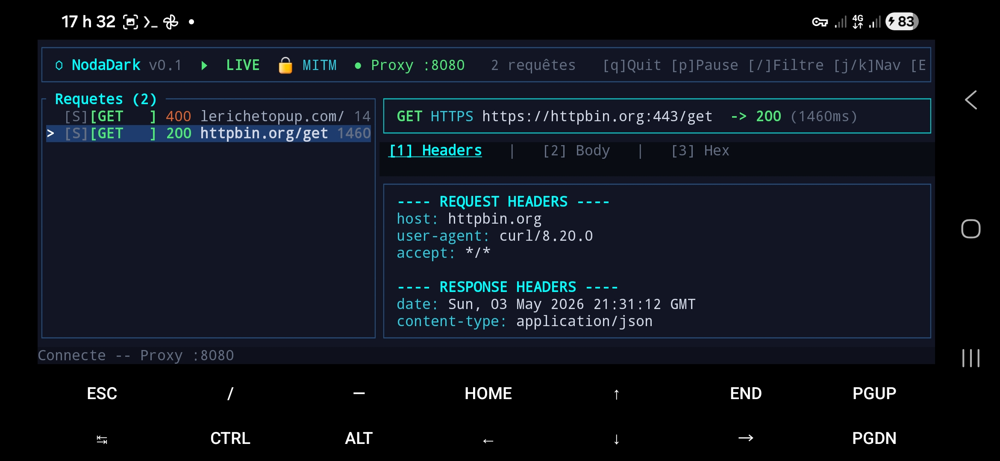

# ⬡ NodaDark

> **Proxy d'Interception Réseau Haute Performance**  
> Un seul moteur Rust. Deux visages : Terminal et Bureau natif.

```
  ╔═╗╔╗╔╔═╗╔╦╗╔═╗╔╦╗╔═╗╦═╗╦╔═
  ║  ║║║║ ║ ║║╠═╣ ║║╠═╣╠╦╝╠╩╗
  ╚═╝╝╚╝╚═╝═╩╝╩ ╩═╩╝╩ ╩╩╚═╩ ╩
  Proxy d'Interception Réseau v0.1.0

  ⚠  À utiliser uniquement sur des réseaux autorisés.

>>>>>>> 3086416 (docs: README complet + screenshots réels)
```

---

## Table des Matières


1. [C'est quoi NodaDark ?](#cest-quoi-nodadark-)
2. [Architecture](#architecture)
3. [Installation sur Termux (Android)](#installation-sur-termux-android)
4. [Lancement — Méthode Officielle (2 Sessions Termux)](#lancement--méthode-officielle-2-sessions-termux)
5. [Configuration du Certificat CA](#configuration-du-certificat-ca)
6. [Générer du trafic et voir les résultats](#générer-du-trafic-et-voir-les-résultats)
7. [Interface TUI — Tous les raccourcis](#interface-tui--tous-les-raccourcis)

1. [C'est quoi NodaDark ?](#cest-quoi-nodadark)
2. [Architecture](#architecture)
3. [Installation](#installation)
   - [Prérequis](#prérequis)
   - [Compiler depuis les sources](#compiler-depuis-les-sources)
   - [Termux (Android)](#termux-android)
4. [Configuration du Certificat CA](#configuration-du-certificat-ca)
   - [Android](#android)
   - [iOS](#ios)
   - [Windows](#windows)
   - [macOS / Linux](#macos--linux)
5. [Utilisation — Mode Terminal (TUI)](#utilisation--mode-terminal-tui)
   - [Lancement](#lancement)
   - [Raccourcis clavier](#raccourcis-clavier)
   - [Filtrage](#filtrage)
6. [Utilisation — Mode Bureau (Desktop)](#utilisation--mode-bureau-desktop)
7. [Utilisation — Mode Ligne de Commande](#utilisation--mode-ligne-de-commande)
 (docs: README complet + screenshots réels)
8. [Règles Persistantes](#règles-persistantes)
9. [API de Contrôle](#api-de-contrôle)
10. [Sessions et Export HAR](#sessions-et-export-har)
11. [FAQ](#faq)
12. [Avertissement Légal](#avertissement-légal)

---

## C'est quoi NodaDark ?


NodaDark est un **proxy d'interception HTTP/HTTPS** (MITM — Man In The Middle) écrit
entièrement en Rust. Il te permet de :

- **Voir** tout le trafic réseau qui passe par ton appareil ou une application cible
- **Modifier** les requêtes (headers, cookies, body) avant qu'elles partent
- **Rejouer** n'importe quelle requête avec ou sans modifications
- **Bloquer** des requêtes selon des règles que tu définis

C'est l'alternative légère et rapide à Burp Suite ou Charles Proxy,
qui tourne aussi bien sur un Samsung A15 sous Termux que sur un serveur Linux.

NodaDark est un **proxy d'interception HTTP/HTTPS** (de type MITM — Man In The Middle) écrit entièrement en Rust. Il te permet de :

- **Voir** tout le trafic réseau qui passe par ton appareil ou une application cible.
- **Modifier** les requêtes (headers, cookies, body) avant qu'elles partent.
- **Rejouer** n'importe quelle requête avec ou sans modifications.
- **Bloquer** (dropper) des requêtes selon des règles que tu définis.

C'est l'alternative légère et rapide à Burp Suite ou Charles Proxy, qui tourne aussi bien sur un Raspberry Pi sans écran que sur ton laptop ou ton téléphone Android via Termux.
 (docs: README complet + screenshots réels)

**Le principe fondateur : "One Core, Many Faces"**

```
[ nodadark-engine ]  ← Moteur Rust (le cerveau)
        │
        ├──▶ nodadark-tui      ← Interface Terminal (SSH, Termux, serveurs)
        └──▶ nodadark-desktop  ← Interface Bureau (Windows, macOS, Linux)
```

---

## Architecture

```
nodadark/

├── Cargo.toml
└── crates/
    ├── nodadark-engine/   ← 🧠 Moteur (proxy MITM, TLS, règles, API)
    ├── nodadark-tui/      ← 🖥  Interface Terminal (Ratatui)
    └── nodadark-desktop/  ← 🎨 Interface Bureau (Tauri + Svelte)

├── Cargo.toml                    ← Workspace Rust
├── README.md
└── crates/
    ├── nodadark-engine/          ← 🧠 Moteur (lib + binaire CLI)
    │   └── src/
    │       ├── proxy/            ← Serveur MITM, TLS, gestion des connexions
    │       ├── rules/            ← Moteur de règles (TOML)
    │       ├── storage/          ← Sauvegarde sessions, export HAR
    │       └── api/              ← Socket Unix + TCP (JSON-lines)
    │
    ├── nodadark-tui/             ← 🖥 Interface Terminal (Ratatui)
    │
    └── nodadark-desktop/         ← 🎨 Interface Bureau (Tauri + Svelte)
 3086416 (docs: README complet + screenshots réels)
```

---


## Installation sur Termux (Android)

```bash
# 1. Mettre à jour Termux
pkg update && pkg upgrade -y

# 2. Installer les dépendances
pkg install rust binutils openssl-dev pkg-config git -y

# 3. Cloner le projet
git clone https://github.com/roscpy/nodadark.git
cd nodadark

# 4. Compiler le moteur
cargo build --release -p nodadark-engine

# 5. Compiler l'interface TUI
cargo build --release -p nodadark-tui

# 6. Vérifier que les binaires existent
ls ~/nodadark/target/release/nodadark*
# nodadark       ← moteur
# nodadark-tui   ← interface terminal
```

> **Note :** La compilation prend environ 1 à 2 minutes sur un bon téléphone Android.
> Une fois compilé, le binaire fonctionne sans recompiler.

---

## Lancement — Méthode Officielle (2 Sessions Termux)

> ⚠️ NodaDark nécessite **2 sessions Termux séparées** pour fonctionner correctement.
> Le moteur tourne en arrière-plan dans la Session 1, et le TUI se connecte dans la Session 2.

### Ouvrir 2 sessions dans Termux

```
Swipe depuis la gauche de l'écran → "New Session"
```

---

### Session 1 — Lancer le moteur (en arrière-plan)

```bash
cd ~/nodadark

# Lancer le moteur sur le port 8080 en arrière-plan
./target/release/nodadark --port 8080 &

# Vérifier qu'il tourne
sleep 2
ps aux | grep nodadark | grep -v grep
```

Tu dois voir quelque chose comme :
```
u0_a344  12345  0.0  0.1  nodadark --port 8080
```

**Sortie attendue au démarrage :**
```
  ╔═╗╔╗╔╔═╗╔╦╗╔═╗╔╦╗╔═╗╦═╗╦╔═
  ...
  INFO 🚀 Proxy démarré sur 127.0.0.1:8080
  INFO 🔌 API TCP : 127.0.0.1:9090
  INFO 🔒 NodaDark CA prêt : ~/.config/nodadark/certs/nodadark-ca.crt
  INFO ✅ 2 règle(s) chargée(s)
```

---

### Session 2 — Lancer le TUI (interface)

Ouvre une nouvelle session Termux (swipe gauche → New Session), puis :

```bash
cd ~/nodadark
./target/release/nodadark-tui --port 9090
```

**Interface attendue :**
```
┌─────────────────────────────────────────────────────────────┐
│ ⬡ NodaDark v0.1  ▶ LIVE  🔒 MITM  ● Proxy :8080           │
├─────────────────────────────────────────────────────────────┤
│ Requetes (0)                                                │
│                                                             │
│                                                             │
├─────────────────────────────────────────────────────────────┤
│ Connecte -- Proxy :8080                                     │
└─────────────────────────────────────────────────────────────┘
```

> ✅ Si tu vois **● (point vert)** à côté de "Proxy :8080" → le TUI est bien connecté au moteur.  
> ❌ Si tu vois **○ (cercle vide)** → le moteur n'est pas lancé, retourne en Session 1.

---

### Session 3 — Générer du trafic (pour tester)

Ouvre une 3ème session et envoie des requêtes via NodaDark :

```bash
# Tester avec httpbin.org (site de test HTTP)
curl --proxy http://127.0.0.1:8080 \
  --cacert ~/.config/nodadark/certs/nodadark-ca.crt \
  -s https://httpbin.org/get -o /dev/null -w "%{http_code}"
```

Retourne sur la **Session 2 (TUI)** — tu verras la requête apparaître :
```
Requetes (1)
> [S][GET] 200 httpbin.org/get  1460ms
```

## Installation

### Prérequis

- **Rust** 1.75+ avec Cargo : https://rustup.rs
- **Pour le Desktop uniquement** : Node.js 18+, npm ou pnpm

```bash
# Installer Rust
curl --proto '=https' --tlsv1.2 -sSf https://sh.rustup.rs | sh
source $HOME/.cargo/env

# Vérifier
rustc --version   # rustc 1.75.0 ou plus récent
cargo --version
```

---

### Compiler depuis les sources

```bash
# 1. Cloner le projet
git clone https://github.com/Roscpy/nodadark.git
cd nodadark

# 2. Compiler le moteur + le TUI (en une commande)
cargo build --release

# 3. Les binaires compilés se trouvent ici :
ls target/release/
# nodadark       ← Moteur seul (mode CLI/log)
# nodadark-tui   ← Interface Terminal
```

Pour le Desktop :
```bash
cd crates/nodadark-desktop
npm install
npm run tauri build
# L'installateur (.exe / .AppImage / .dmg) se trouve dans :
# src-tauri/target/release/bundle/
```

---

### Termux (Android)

```bash
# 1. Installer les dépendances dans Termux
pkg update && pkg upgrade
pkg install rust binutils openssl-dev pkg-config

# 2. Cloner et compiler (TUI uniquement, pas de Desktop sans bureau graphique)
git clone https://github.com/Roscpy/nodadark.git
cd nodadark
cargo build --release -p nodadark-tui

# 3. Optionnel : ajouter au PATH
cp target/release/nodadark-tui $PREFIX/bin/

# 4. Lancer
nodadark-tui --embedded 8080
```

> **Note Termux** : Le flag `--embedded 8080` démarre le moteur proxy intégré directement depuis le TUI sans avoir à lancer un processus séparé.
 (docs: README complet + screenshots réels)

---

## Configuration du Certificat CA


Pour intercepter le trafic **HTTPS**, NodaDark génère automatiquement un certificat CA
racine au premier lancement. Tu dois l'installer sur l'appareil cible.

**Chemin du certificat :**
```bash
~/.config/nodadark/certs/nodadark-ca.crt
# ou sur Termux :
/data/data/com.termux/files/home/.config/nodadark/certs/nodadark-ca.crt
```

### Copier le CA vers le stockage Android

```bash
cp ~/.config/nodadark/certs/nodadark-ca.crt /sdcard/Download/nodadark-ca.crt
```

### Installer dans Firefox Android (recommandé — fonctionne sans root)

```
1. Ouvre Firefox Android
2. Menu (3 points) → Paramètres
3. Sécurité et confidentialité
4. Certificats → Importer un certificat
5. Sélectionne /sdcard/Download/nodadark-ca.crt
```

### Installer dans Firefox via about:config (proxy sans Wi-Fi, 4G OK)

```
1. Dans Firefox, tape : about:config
2. network.proxy.type → 1
3. network.proxy.http → 127.0.0.1
4. network.proxy.http_port → 8080
5. network.proxy.ssl → 127.0.0.1
6. network.proxy.ssl_port → 8080
```

### Sur Android (système) — si Wi-Fi disponible

```
Paramètres → Sécurité → Installer depuis la mémoire →
Sélectionne nodadark-ca.crt → "NodaDark CA"

Wi-Fi → Maintenir appuyé sur le réseau → Modifier →
Proxy Manuel → 127.0.0.1 → Port 8080
```

### Sur Linux / macOS

```bash
# Ubuntu/Debian
sudo cp ~/.config/nodadark/certs/nodadark-ca.crt \
  /usr/local/share/ca-certificates/nodadark.crt
sudo update-ca-certificates


Pour intercepter le trafic **HTTPS**, NodaDark génère un certificat CA racine auto-signé. Tu dois l'installer comme autorité de confiance sur l'appareil dont tu veux analyser le trafic.

Le certificat est généré automatiquement au premier lancement et sauvegardé ici :
- **Linux / Android** : `~/.config/nodadark/certs/nodadark-ca.crt`
- **Windows** : `%APPDATA%\nodadark\certs\nodadark-ca.crt`
- **macOS** : `~/Library/Application Support/nodadark/certs/nodadark-ca.crt`

---

### Android

1. Copie `nodadark-ca.crt` sur le téléphone (via ADB ou partage de fichier).
2. Va dans **Paramètres → Sécurité → Chiffrement et identifiants → Installer depuis la mémoire**.
3. Sélectionne le fichier `.crt`.
4. Donne-lui un nom (ex: "NodaDark CA").
5. Choisis **VPN et applications** ou **Wi-Fi** selon ton besoin.

---

### iOS

1. Envoie le fichier `nodadark-ca.crt` sur l'iPhone (mail, AirDrop, etc.).
2. Ouvre le fichier → **Installer le profil**.
3. Va dans **Réglages → Profil téléchargé → Installer**.
4. Ensuite : **Réglages → Général → À propos → Réglages du certificat** → Active la confiance totale pour le certificat NodaDark.

---

### Windows

1. Double-clique sur `nodadark-ca.crt`.
2. Clique sur **Installer le certificat**.
3. Choisis **Ordinateur local** → **Suivant**.
4. Sélectionne **Placer tous les certificats dans le magasin suivant**.
5. Parcourir → **Autorités de certification racines de confiance** → OK → Terminer.

---

### macOS / Linux

```bash
 (docs: README complet + screenshots réels)
# macOS
sudo security add-trusted-cert -d -r trustRoot \
  -k /Library/Keychains/System.keychain \
  ~/.config/nodadark/certs/nodadark-ca.crt

```

### Via curl (sans installation CA système)

```bash
# Spécifier le CA directement dans curl
curl --proxy http://127.0.0.1:8080 \
  --cacert ~/.config/nodadark/certs/nodadark-ca.crt \
  https://cible.com


# Ubuntu / Debian
sudo cp ~/.config/nodadark/certs/nodadark-ca.crt /usr/local/share/ca-certificates/nodadark.crt
sudo update-ca-certificates

# Arch / Fedora
sudo trust anchor --store ~/.config/nodadark/certs/nodadark-ca.crt
>>>>>>> 3086416 (docs: README complet + screenshots réels)
```

---


## Générer du trafic et voir les résultats

### Test de base — httpbin.org

```bash
# Session 3 Termux
curl --proxy http://127.0.0.1:8080 \
  --cacert ~/.config/nodadark/certs/nodadark-ca.crt \
  -s https://httpbin.org/get
```

**Ce que tu verras dans le TUI :**
```
[S][GET] 200 httpbin.org/get  1460ms
```

**Onglet 2 — Body :**
```json
{
  "args": {},
  "headers": {
    "Accept": "*/*",
    "Host": "httpbin.org",
    "User-Agent": "curl/8.20.0"
  },
  "origin": "TON_IP",
  "url": "https://httpbin.org/get"
}
```

### Test POST — voir le body envoyé

```bash
curl --proxy http://127.0.0.1:8080 \
  --cacert ~/.config/nodadark/certs/nodadark-ca.crt \
  -X POST https://httpbin.org/post \
  -H "Content-Type: application/json" \
  -d '{"username":"test","password":"secret123"}'
```

### Test avec plusieurs requêtes simultanées

```bash
for site in httpbin.org/get httpbin.org/post httpbin.org/headers; do
  curl --proxy http://127.0.0.1:8080 \
    --cacert ~/.config/nodadark/certs/nodadark-ca.crt \
    -s https://$site -o /dev/null &
done
wait
```

---

## Interface TUI — Tous les raccourcis

### Navigation
=======
## Utilisation — Mode Terminal (TUI)

### Lancement

```bash
# Option 1 : TUI seul (le moteur doit déjà tourner séparément)
nodadark-tui --socket /tmp/nodadark.sock

# Option 2 : TUI avec moteur intégré (tout-en-un, recommandé)
nodadark-tui --embedded 8080

# Option 3 : Via TCP si le socket Unix n'est pas disponible (Windows)
nodadark-tui --port 9090

# Aide complète
nodadark-tui --help
```

### Interface

```
┌─────────────────────────────────────────────────────────────────┐
│ ⬡ NodaDark v0.1  ▶ LIVE  🔒 MITM  ● Proxy :8080  142 requêtes │
│         [q]Quit [p]Pause [/]Filtre [j/k]Nav [Enter]Détail      │
└──────────────────────────────────┬──────────────────────────────┘
│ Requêtes (142)                   │ [1]Headers [2]Body [3]Hex   │
│ 🔒[GET   ] 200 api.example.com   │ ────── REQUEST HEADERS ──── │
│ 🔒[POST  ] 302 login.target.com  │ Host: api.example.com       │
│ ▶🔒[GET  ] 500 vuln.site/xss    │ Cookie: session=abc123…     │
│                                  │ Authorization: Bearer tok…  │
│                                  │ ─── RESPONSE HEADERS ───── │
│                                  │ Content-Type: application/  │
│                                  │ json                        │
└──────────────────────────────────┴─────────────────────────────┘
│ [⏸ PAUSE] | Filtre: *.example.com | ✓ Connecté au moteur      │
└─────────────────────────────────────────────────────────────────┘
```

### Raccourcis clavier
 (docs: README complet + screenshots réels)

| Touche | Action |
|--------|--------|
| `j` / `↓` | Descendre dans la liste |
| `k` / `↑` | Monter dans la liste |
| `G` | Aller à la dernière requête |
| `g` | Aller à la première requête |
| `PageDown` | Descendre de 10 lignes |
| `PageUp` | Monter de 10 lignes |


### Sélection et Détail

| Touche | Action |
|--------|--------|
| `Enter` | Ouvrir le détail de la requête |
| `Esc` | Retour à la liste / fermer popup |
| `Tab` | Basculer Headers → Body → Hex |
| `1` | Onglet Headers |
| `2` | Onglet Body (JSON formaté automatiquement) |
| `3` | Onglet Hex Viewer |

### Actions

| Touche | Action |
|--------|--------|
| `a` | Menu d'actions (Replay, Edit, Drop...) |
| `r` | Rejouer la requête directement |
| `d` | Dropper la requête |
| `e` | Éditeur de cookies |
| `p` | Pause / Reprise du proxy |
| `i` | Charger le détail complet |
| `Ctrl+C` | Effacer tout l'historique |

| `Enter` | Ouvrir le détail de la requête |
| `Tab` | Basculer entre onglets Headers / Body / Hex |
| `1` `2` `3` | Aller directement à l'onglet (dans le détail) |
| `a` | Ouvrir le menu d'actions (Replay, Edit, Drop…) |
| `r` | Rejouer la requête sélectionnée |
| `d` | Dropper la requête sélectionnée |
| `i` | Charger le détail complet depuis le moteur |
| `e` | Ouvrir l'éditeur de cookies |
| `p` | Basculer Pause / Reprise du proxy |
| `/` | Activer le filtre de recherche |
| `Ctrl+C` | Effacer tout l'historique |
| `Esc` | Retour à la liste / fermer popup |
 (docs: README complet + screenshots réels)
| `q` | Quitter |

### Filtrage


| Touche | Action |
|--------|--------|
| `/` | Activer la recherche live |
| `/google` | Filtrer par domaine |
| `/POST` | Filtrer par méthode |
| `/500` | Filtrer par code d'erreur |
| `Enter` | Valider le filtre |
| `Esc` | Effacer le filtre |

### Légende des couleurs

| Couleur | Signification |
|---------|---------------|
| 🟢 Vert | Code 2xx — Succès |
| 🟡 Jaune | Code 3xx — Redirection |
| 🔴 Rouge | Code 4xx/5xx — Erreur |
| 🔵 Cyan | Requête en attente |
| ⬛ Gris | Requête droppée |
| 🔒 [S] | Requête HTTPS (SSL) |

Appuie sur `/` pour ouvrir la barre de recherche. Le filtrage est **live** (instantané) et cherche dans :
- L'URL complète
- Le nom de domaine (host)
- La méthode HTTP (`GET`, `POST`…)
- Le code de statut (`200`, `404`…)

Exemples :
```
/google.com        ← Toutes les requêtes vers google.com
/POST              ← Uniquement les POST
/500               ← Uniquement les erreurs 500
/api               ← Toutes les URLs contenant "api"
```

Appuie sur `Enter` pour valider, `Esc` pour effacer le filtre.

---

## Utilisation — Mode Bureau (Desktop)

Lance l'application `.exe` (Windows), `.app` (macOS), ou `.AppImage` (Linux).

**Premier lancement :**
1. Le proxy démarre automatiquement sur le port **8080**.
2. Configure ton appareil/navigateur pour utiliser `127.0.0.1:8080` comme proxy HTTP/HTTPS.
3. Installe le certificat CA affiché dans ⚙ **Paramètres**.

**Fonctionnalités de l'interface :**

| Zone | Description |
|------|-------------|
| Toolbar | Démarrer/Arrêter, Pause, filtre de scope, effacer |
| Liste (gauche) | Flux live des requêtes avec codes couleur |
| Détail (droite) | Headers, Body formaté JSON, Hex viewer |
| 🍪 Cookie Editor | Éditer les cookies et renvoyer la requête |

**Raccourcis clavier Desktop :**

| Raccourci | Action |
|-----------|--------|
| `Ctrl+P` | Pause / Reprise |
| `Ctrl+L` | Focus sur le filtre de recherche |
| `Ctrl+R` | Rejouer la requête sélectionnée |
| `Esc` | Désélectionner / fermer modal |
| `1` `2` `3` | Changer d'onglet dans le détail |

---

## Utilisation — Mode Ligne de Commande

Pour une utilisation sur serveur sans interface :

```bash
# Démarrage basique
nodadark --port 8080

# Avec logs détaillés
nodadark --port 8080 --verbose

# Mode strict (bloque les certificats invalides)
nodadark --port 8080 --strict

# Changer le port de l'API de contrôle
nodadark --port 8080 --api-port 9090

# Voir toutes les options
nodadark --help
```

Le proxy loggue tout le trafic dans le terminal. Configure ton appareil pour passer par `IP_SERVEUR:8080`.
 (docs: README complet + screenshots réels)

---

## Règles Persistantes


Fichier : `~/.config/nodadark/rules.toml`

```toml
# Bloquer un tracker
[[rules]]
name = "Bloquer analytics"
enabled = true
domain = "*.analytics.com"
action = { type = "drop" }

# Modifier le User-Agent
[[rules]]
name = "Fake User-Agent"
enabled = true
action = { type = "modify_header", name = "User-Agent", value = "NodaDark Audit" }

# Supprimer un header
[[rules]]
name = "Supprimer X-Frame-Options"

Les règles permettent d'automatiser des actions sur le trafic. Elles sont dans :
- **Linux / Android** : `~/.config/nodadark/rules.toml`
- **Windows** : `%APPDATA%\nodadark\rules.toml`

Format TOML :

```toml
# Exemple 1 : Supprimer un header sur un domaine spécifique
[[rules]]
name = "Supprimer X-Frame-Options sur example.com"
 (docs: README complet + screenshots réels)
enabled = true
domain = "*.example.com"
action = { type = "remove_header", name = "X-Frame-Options" }


# Injecter un header de debug
[[rules]]
name = "Mode debug API"

# Exemple 2 : Remplacer le User-Agent sur tous les sites
[[rules]]
name = "Fake User-Agent"
enabled = true
action = { type = "modify_header", name = "User-Agent", value = "Mozilla/5.0 NodaDark" }

# Exemple 3 : Dropper toutes les requêtes vers un tracker
[[rules]]
name = "Bloquer tracker analytics"
enabled = true
domain = "*.analytics-tracker.com"
action = { type = "drop" }

# Exemple 4 : Injecter un header sur une API spécifique
[[rules]]
name = "Ajouter X-Debug sur /api/*"
 (docs: README complet + screenshots réels)
enabled = true
domain = "api.monapp.com"
path = "/api/*"
action = { type = "inject_header", name = "X-Debug-Mode", value = "true" }
```


Les règles sont lues au démarrage. Pour les recharger, redémarre le moteur.

**Champs disponibles :**

| Champ | Description | Exemple |
|-------|-------------|---------|
| `name` | Nom lisible de la règle | `"Bloquer pub"` |
| `enabled` | Activer/désactiver sans supprimer | `true` / `false` |
| `domain` | Filtre de domaine (glob `*` supporté) | `"*.google.com"` |
| `path` | Filtre de chemin | `"/api/*"` |
| `method` | Filtre de méthode HTTP | `"POST"` |
| `action.type` | Action : `drop`, `modify_header`, `remove_header`, `inject_header` | |

Les règles sont lues au démarrage du moteur. Pour les recharger sans redémarrer : relance simplement le binaire.
 (docs: README complet + screenshots réels)

---

## API de Contrôle


NodaDark expose une API JSON-lines sur :
- **TCP** : `127.0.0.1:9090`
- **Socket Unix** : `/tmp/nodadark.sock` (Linux/Android)

```bash
# Vérifier l'état
echo '{"command":"status"}' | nc -q1 127.0.0.1 9090

# Mettre en pause
echo '{"command":"pause"}' | nc -q1 127.0.0.1 9090

# Reprendre
echo '{"command":"resume"}' | nc -q1 127.0.0.1 9090

# Lister les 10 dernières requêtes
echo '{"command":"list_requests","limit":10}' | nc -q1 127.0.0.1 9090

# Rejouer une requête
echo '{"command":"replay","id":"ID_ICI"}' | nc -q1 127.0.0.1 9090

# Dropper une requête
echo '{"command":"drop","id":"ID_ICI"}' | nc -q1 127.0.0.1 9090

# Effacer l'historique
echo '{"command":"clear_requests"}' | nc -q1 127.0.0.1 9090

# S'abonner aux événements live (streaming)
echo '{"command":"subscribe"}' | nc 127.0.0.1 9090

NodaDark expose une API JSON-lines sur deux interfaces :

- **Socket Unix** : `/tmp/nodadark.sock` (Linux / macOS / Android)
- **TCP** : `127.0.0.1:9090`

### Connexion

```bash
# Via netcat (TCP)
nc 127.0.0.1 9090

# Via socat (Unix socket)
socat - UNIX-CONNECT:/tmp/nodadark.sock
```

### Commandes disponibles

```json
// Mettre en pause
{"command":"pause"}

// Reprendre
{"command":"resume"}

// Lister les requêtes (paginées, avec filtre optionnel)
{"command":"list_requests","offset":0,"limit":50,"filter":"google"}

// Obtenir le détail d'une requête
{"command":"get_request","id":"abc123-..."}

// Dropper une requête
{"command":"drop","id":"abc123-..."}

// Rejouer une requête (avec headers modifiés optionnels)
{"command":"replay","id":"abc123-...","modified_headers":{"Cookie":"session=NEW_VALUE"}}

// Effacer tout l'historique
{"command":"clear_requests"}

// Sauvegarder la session
{"command":"save_session","name":"audit-2024"}

// Exporter en HAR
{"command":"export_har","name":"export"}

// État du proxy
{"command":"status"}

// S'abonner aux événements temps réel (streaming)
{"command":"subscribe"}
```

### Réponses

```json
// Succès
{"type":"ok","message":"Proxy mis en pause"}

// Erreur
{"type":"error","message":"Requête introuvable"}

// État
{"type":"status","paused":false,"port":8080,"request_count":142,"ca_path":"/home/user/.config/nodadark/certs/nodadark-ca.crt"}

// Liste de requêtes
{"type":"requests","items":[...],"total":142}

// Événement temps réel (après subscribe)
{"type":"request","id":"abc","method":"GET","url":"https://...","tls":true,"timestamp":"..."}
{"type":"response","id":"abc","status":200,"duration_ms":45,"size":1024}
```

### Exemple : script bash d'automatisation

```bash
#!/bin/bash
# Mettre le proxy en pause, attendre 5 secondes, reprendre

echo '{"command":"pause"}' | nc -q1 127.0.0.1 9090
echo "Proxy en pause..."
sleep 5
echo '{"command":"resume"}' | nc -q1 127.0.0.1 9090
echo "Proxy repris."
 (docs: README complet + screenshots réels)
```

---

## Sessions et Export HAR


```bash
# Sauvegarder la session actuelle
echo '{"command":"save_session","name":"audit-client"}' | nc -q1 127.0.0.1 9090

# Exporter en HAR (compatible Chrome DevTools, Burp)
echo '{"command":"export_har","name":"export"}' | nc -q1 127.0.0.1 9090

# Fichiers sauvegardés dans :
# ~/.local/share/nodadark/sessions/

### Sauvegarder une session

```bash
# Via l'API
echo '{"command":"save_session","name":"test-login"}' | nc -q1 127.0.0.1 9090

# Les sessions sont sauvegardées dans :
# Linux : ~/.local/share/nodadark/sessions/test-login-20240101-120000.nds
# Windows : %LOCALAPPDATA%\nodadark\sessions\
```

### Exporter en HAR

Le format HAR (HTTP Archive) est compatible avec :
- **Chrome DevTools** (onglet Réseau → Import)
- **Burp Suite** (Import HAR)
- **Analyse de performance** en ligne (har.tech, etc.)

```bash
echo '{"command":"export_har","name":"audit"}' | nc -q1 127.0.0.1 9090
 (docs: README complet + screenshots réels)
```

---

## FAQ


**Q : Le TUI affiche "○ Proxy :8080" (cercle vide) — que faire ?**
R : Le moteur n'est pas lancé. Va en Session 1 et vérifie :
```bash
ps aux | grep nodadark | grep -v grep
# Si vide → relancer : cd ~/nodadark && ./target/release/nodadark --port 8080 &
```

**Q : curl retourne "proxychains: can't load process"**
R : Proxychains intercepte curl. Solution :
```bash
# Vérifier si curl est une fonction dans .bashrc
grep curl ~/.bashrc
# Si oui, supprimer la fonction et recharger :
sed -i '/proxychains/d' ~/.bashrc && source ~/.bashrc
```

**Q : Comment tester sans Wi-Fi (4G seulement) ?**
R : Utilise curl avec `--proxy` directement — ça fonctionne sur 4G :
```bash
curl --proxy http://127.0.0.1:8080 \
  --cacert ~/.config/nodadark/certs/nodadark-ca.crt \
  https://cible.com
```

**Q : Le moteur s'arrête immédiatement après le lancement ?**
R : Utilise `&` pour le lancer en arrière-plan :
```bash
./target/release/nodadark --port 8080 &
```

**Q : Comment intercepter un autre appareil ?**
R : Active le hotspot sur ton téléphone, lance NodaDark avec `--bind 0.0.0.0` :
```bash
./target/release/nodadark --port 8080 --bind 0.0.0.0 &
```
L'autre appareil utilise ton IP comme proxy.

**Q : Certificat pinning — NodaDark ne voit pas le trafic d'une app ?**
R : L'app utilise du certificate pinning. Sans root + Frida, ce trafic est inaccessible. NodaDark intercepte les apps sans pinning et les navigateurs.

**Q : Comment configurer mon téléphone pour passer par NodaDark ?**  
R : Va dans les paramètres Wi-Fi de ton téléphone → maintiens appuyé sur le réseau → Modifier → Proxy Manuel → Hostname : `IP_DE_TON_PC` → Port : `8080`. Puis installe le certificat CA.

**Q : NodaDark tourne-t-il sur Windows ?**  
R : Oui. Le socket Unix n'est pas disponible sur Windows mais le TCP (port 9090) fonctionne. Le TUI tourne dans Windows Terminal ou PowerShell. Le Desktop Tauri génère un `.exe` natif.

**Q : Est-ce que ça marche avec les applis Android qui épinglent leurs certificats (certificate pinning) ?**  
R : Les applis avec pinning ne font pas confiance à un CA externe. Pour les contourner, il faut patcher l'APK (via Frida ou Objection) ou utiliser un émulateur rooté. NodaDark gère la partie proxy, mais le contournement du pinning est une étape séparée.

**Q : Quelle différence avec Burp Suite ?**  
R : Burp nécessite Java et pèse plusieurs centaines de Mo. NodaDark est un binaire Rust statique de quelques Mo, sans dépendance. Il tourne sur ARM (Termux, Raspberry Pi). En contrepartie, Burp Suite a des fonctionnalités d'audit plus avancées (scanner de vulnérabilités, Intruder, etc.).

**Q : Le moteur peut-il tourner en arrière-plan comme un daemon ?**  
R : Oui, lance `nodadark --port 8080` dans un `tmux` ou `screen`, ou crée un service systemd. Exemple :

```ini
# /etc/systemd/system/nodadark.service
[Unit]
Description=NodaDark Proxy
After=network.target

[Service]
ExecStart=/usr/local/bin/nodadark --port 8080 --bind 0.0.0.0
Restart=on-failure
User=ton-user

[Install]
WantedBy=multi-user.target
```

```bash
sudo systemctl enable nodadark
sudo systemctl start nodadark
```

**Q : Le TUI ne se connecte pas au moteur.**  
R : Vérifie que le moteur tourne (`nodadark --port 8080`) et que le socket existe (`ls /tmp/nodadark.sock`). Si tu es sur Windows, utilise `--port 9090` à la place du socket Unix.
 (docs: README complet + screenshots réels)

---

## Avertissement Légal


> ⚠️ **NodaDark est un outil d'audit de sécurité réseau.**  
> Son utilisation est **strictement réservée** aux réseaux et appareils pour lesquels  
> tu as une **autorisation explicite et écrite**.  
> Intercepter le trafic réseau sans autorisation est **illégal** dans la plupart des pays.  
> L'auteur décline toute responsabilité pour toute utilisation abusive.  
> **Usage légal uniquement : pentest autorisé, débogage de tes propres apps, audit avec accord écrit.**

---

*NodaDark v0.1.0 — "One Core, Many Faces" — Fait avec ❤ en Rust sur Samsung A15 / Termux*

---

## 📸 Screenshots — NodaDark en Action (Tests Réels)

> Toutes les captures ci-dessous ont été prises sur un **Samsung A15 Android**  
> avec **Termux**, en **4G** (sans Wi-Fi), le **03 Mai 2026**.

---

### 1. Liste live — Interception de google.com, github.com et cloudflare.com


```
Requetes (3)
> [S][GET]      ... google.com          ← En attente (cyan)
  [S][GET]  200 github.com      405ms  ← Succès (vert)
  [S][GET]  301 cloudflare.com  406ms  ← Redirection (jaune)
```

**Ce qu'on voit :**
- `[S]` = Requête HTTPS (SSL intercepté par NodaDark)
- `[GET]` = Méthode HTTP
- `200` = Réponse GitHub en vert ✅
- `301` = Redirection Cloudflare en jaune 🟡
- `...` = Google encore en attente (cyan) 🔵
- `● Proxy :8080` = Point vert → TUI connecté au moteur

---

### 2. Onglet Headers — Request & Response



```
GET HTTPS https://httpbin.org:443/get  →  200 (1460ms)

---- REQUEST HEADERS ----
host:        httpbin.org
user-agent:  curl/8.20.0
accept:      */*

---- RESPONSE HEADERS ----
date:          Sun, 03 May 2026 21:31:12 GMT
content-type:  application/json
```

**Ce qu'on voit :**
- **REQUEST HEADERS** (en cyan) = ce que ton appareil envoie
- **RESPONSE HEADERS** (en cyan) = ce que le serveur répond
- Les headers sensibles (`Cookie`, `Authorization`) apparaissent en jaune automatiquement

---

### 3. Onglet Body — JSON formaté automatiquement


```
Body (255 octets)
{
    "args": {},
    "headers": {
        "Accept": "*/*",
        "Host": "httpbin.org",
        "User-Agent": "curl/8.20.0",
        "X-Amzn-Trace-Id": "Root=1-69f7bea0-..."
    },
    ...
}
```

**Ce qu'on voit :**
- Body JSON **formaté et indenté automatiquement** par NodaDark
- Taille du body affichée : `255 octets`
- En pentest : c'est ici qu'on voit les **mots de passe**, **tokens**, **données POST**

---

### 4. Onglet Hex Viewer — Données brutes


```
Hex Viewer (255 octets)
00000000  7b 0a 20 20 22 61 72 67...  | {.  "arg
00000010  0a 20 20 22 68 65 61 64...  | ..  "head
00000020  20 20 20 20 22 41 63 63...  |     "Acc
00000030  2f 2a 22 2c 20 0a 20 20...  | /*",  .
```

**Ce qu'on voit :**
- Colonne gauche = **offset hexadécimal** (position dans les données)
- Colonne centrale = **valeurs hexadécimales** des octets (cyan)
- Colonne droite = **représentation ASCII** des mêmes octets
- Utile pour analyser les **données binaires**, détecter des caractères cachés

---

### Comment placer les screenshots dans le repo

```bash
# Créer le dossier dans ton repo GitHub
mkdir -p docs/screenshots

# Copier tes screenshots dedans
cp screenshot_*.jpg docs/screenshots/

# Commit
git add docs/screenshots/
git commit -m "feat: add real demo screenshots"
git push
```


> ⚠ **NodaDark est un outil d'audit de sécurité réseau.**  
> Son utilisation est **strictement réservée** aux réseaux et appareils sur lesquels tu as une autorisation explicite.  
> Intercepter le trafic réseau sans autorisation est **illégal** dans la plupart des pays.  
> L'auteur décline toute responsabilité pour toute utilisation abusive de cet outil.  
> **Utilise-le uniquement dans un cadre légal : test de pénétration autorisé, débogage de tes propres applications, audit de sécurité avec accord écrit.**

---

*NodaDark — "One Core, Many Faces" — Fait avec ❤ en Rust*
 (docs: README complet + screenshots réels)
