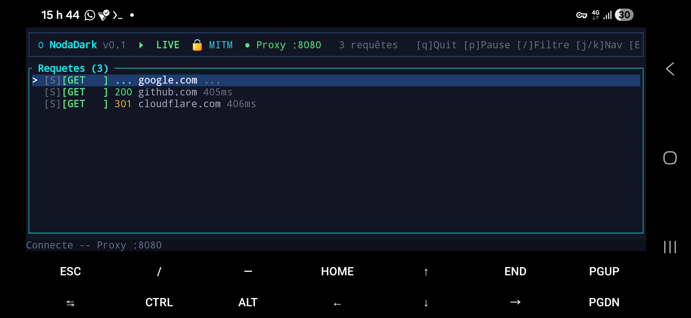
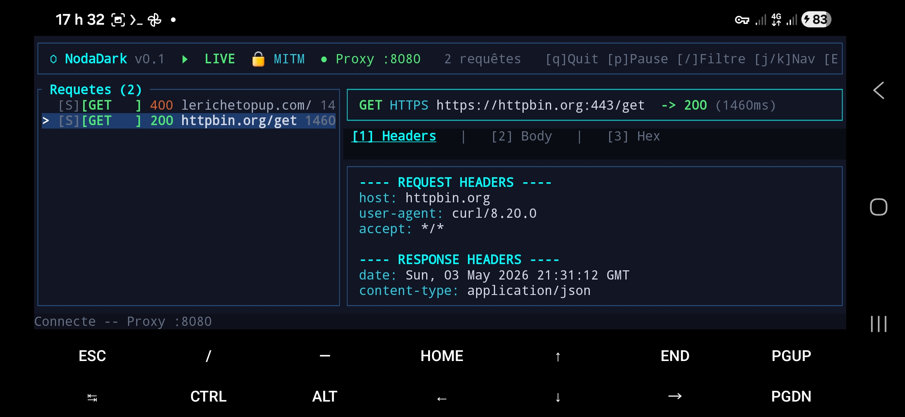
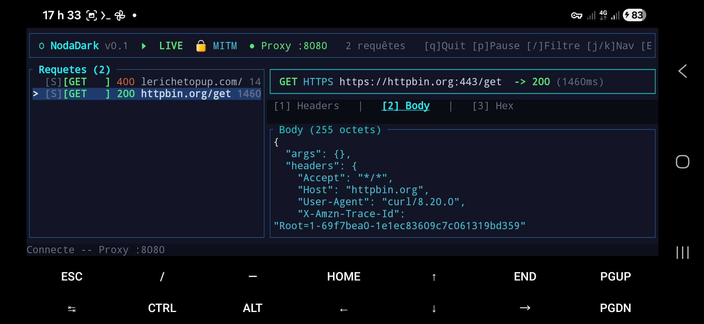
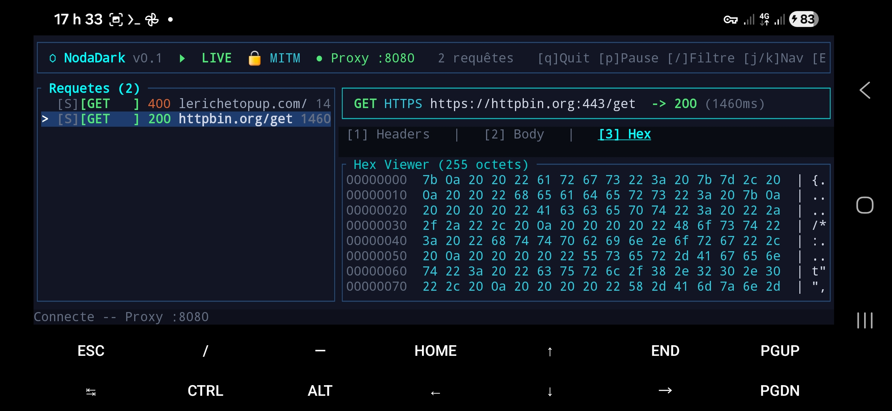

# ⬡ NodaDark

> **Proxy d'Interception Réseau — MITM Haute Performance**
> Un seul moteur Rust. Deux visages : Terminal et Bureau natif.

```
  ╔═╗╔╗╔╔═╗╔╦╗╔═╗╔╦╗╔═╗╦═╗╦╔═
  ║  ║║║║ ║ ║║╠═╣ ║║╠═╣╠╦╝╠╩╗
  ╚═╝╝╚╝╚═╝═╩╝╩ ╩═╩╝╩ ╩╩╚═╩ ╩
  Proxy d'Interception Réseau v0.1.5
  ⚠  À utiliser uniquement sur des réseaux autorisés.
```

---

## Table des Matières

1. [C'est quoi NodaDark ?](#cest-quoi-nodadark-)
2. [Architecture](#architecture)
3. [Installation sur Termux Android](#installation-sur-termux-android)
4. [Lancement](#lancement)
5. [Screenshots réels](#screenshots-réels)
6. [Configuration du Certificat CA](#configuration-du-certificat-ca)
7. [Nouveautés v0.1.5](#nouveautés-v015)
8. [Interface TUI — Tous les raccourcis](#interface-tui--tous-les-raccourcis)
9. [Règles Persistantes](#règles-persistantes)
10. [API de Contrôle](#api-de-contrôle)
11. [Alias et fonctions bash](#alias-et-fonctions-bash)
12. [FAQ](#faq)
13. [Avertissement Légal](#avertissement-légal)

---

## C'est quoi NodaDark ?

NodaDark est un **proxy d'interception HTTP/HTTPS** (MITM — Man In The Middle) écrit entièrement en Rust. Il te permet de :

- **Voir** tout le trafic réseau en temps réel
- **Modifier** les requêtes (headers, cookies, body) avant qu'elles partent
- **Rejouer** n'importe quelle requête avec ou sans modifications
- **Bloquer** des requêtes selon des règles définies dans un fichier TOML
- **Analyser** automatiquement les headers de sécurité manquants
- **Détecter** les flags manquants sur les cookies (HttpOnly, Secure, SameSite)

C'est l'alternative légère à Burp Suite qui tourne sur un **Samsung A15 sous Termux en 4G**.

**Principe fondateur : "One Core, Many Faces"**

```
[ nodadark-engine ]  ← Moteur Rust (le cerveau)
        │
        ├──▶ nodadark-tui      ← Interface Terminal (SSH, Termux, serveurs)
        └──▶ nodadark-desktop  ← Interface Bureau (Windows, macOS, Linux)
```

---

## Architecture

```
nodadark/
├── Cargo.toml
└── crates/
    ├── nodadark-engine/   ← 🧠 Moteur (proxy MITM, TLS, règles, API)
    │   └── src/
    │       ├── proxy/     ← Serveur HTTP/HTTPS, tunnels TLS, certs
    │       ├── rules/     ← Moteur de règles TOML
    │       ├── storage/   ← Sessions, export HAR
    │       └── api/       ← Socket Unix + TCP JSON-lines
    ├── nodadark-tui/      ← 🖥  Interface Terminal (Ratatui)
    └── nodadark-desktop/  ← 🎨 Interface Bureau (Tauri + Svelte)
```

---

## Installation sur Termux Android

```bash
# 1. Mettre à jour Termux
pkg update && pkg upgrade -y

# 2. Installer les dépendances
pkg install rust binutils openssl-dev pkg-config git -y

# 3. Cloner le projet
git clone https://github.com/roscpy/nodadark.git
cd nodadark

# 4. Lancer le script d'installation automatique
bash install.sh

# Le script compile, installe dans le PATH, génère le CA, et ajoute les alias
```

### Installation manuelle

```bash
cd ~/nodadark

# Compiler les deux binaires
cargo build --release -p nodadark-engine -p nodadark-tui

# Installer dans le PATH
cp target/release/nodadark $PREFIX/bin/
cp target/release/nodadark-tui $PREFIX/bin/

# Vérifier
nodadark --version
nodadark-tui --version
```

---

## Lancement

### Méthode 1 — Mode tout-en-un (recommandé sur Termux)

Une seule session, une seule commande :

```bash
nodadark-tui --embedded 8080
```

Le moteur et le TUI démarrent ensemble. Le moteur tourne en arrière-plan, le TUI se connecte automatiquement.

---

### Méthode 2 — 2 Sessions séparées

Pour un contrôle plus fin ou pour surveiller les logs du moteur.

Ouvre 2 sessions Termux (swipe gauche → New Session) :

**Session 1 — Moteur :**
```bash
nodadark --port 8080 &
```

Sortie attendue :
```
INFO 🚀 Proxy démarré sur 127.0.0.1:8080
INFO 🔌 API TCP : 127.0.0.1:9090
INFO 🔒 NodaDark CA prêt
INFO ✅ 4 règle(s) chargée(s)
```

**Session 2 — TUI :**
```bash
nodadark-tui --port 9090
```

**Session 3 — Générer du trafic :**
```bash
curl --proxy http://127.0.0.1:8080 \
  --cacert ~/.config/nodadark/certs/nodadark-ca.crt \
  -s https://httpbin.org/get
```

> ✅ Point vert `●` = TUI connecté au moteur
> ❌ Cercle vide `○` = moteur non lancé

---

## Screenshots réels

> Captures prises sur Samsung A15 — Termux — 4G — 03 Mai 2026

### 1. Liste live — google.com, github.com, cloudflare.com



```
Requetes (3/3)
> [S][GET]      ... google.com          ← En attente (cyan)
  [S][GET]  200 github.com      405ms  ← Succès (vert)
  [S][GET]  301 cloudflare.com  406ms  ← Redirection (jaune)
```

- `[S]` = HTTPS intercepté par NodaDark
- `● Proxy :8080` = point vert → TUI connecté

---

### 2. Onglet Headers — Request + Response + Security Analysis



```
---- REQUEST HEADERS ----
host:       httpbin.org
user-agent: curl/8.20.0

---- RESPONSE HEADERS ----
content-type: application/json
server:       gunicorn/19.9.0

---- SECURITY ANALYSIS ----
❌ HSTS                  ABSENT → Risque: SSL Stripping
❌ X-Frame-Options        ABSENT → Risque: Clickjacking
❌ CSP                   ABSENT → Risque: XSS / Injection
✅ X-Content-Type-Options présent
```

---

### 3. Onglet Body — JSON formaté automatiquement



```json
{
  "args": {},
  "headers": {
    "Host": "httpbin.org",
    "User-Agent": "curl/8.20.0"
  },
  "origin": "89.47.234.230",
  "url": "https://httpbin.org/get"
}
```

---

### 4. Onglet Hex Viewer



```
00000000  7b 0a 20 20 22 61 72 67...  | {.  "arg
00000010  0a 20 20 22 68 65 61 64...  | ..  "head
```

---

## Configuration du Certificat CA

NodaDark génère un CA racine au premier lancement. Il faut l'installer pour intercepter le HTTPS.

**Chemin du certificat :**
```bash
~/.config/nodadark/certs/nodadark-ca.crt
```

### Copier vers le stockage Android

```bash
# Après avoir autorisé le stockage : termux-setup-storage
cp ~/.config/nodadark/certs/nodadark-ca.crt ~/storage/downloads/nodadark-ca.crt
```

### Installer dans Firefox Android (sans root, fonctionne en 4G)

```
1. Firefox → Menu → Paramètres → Sécurité
2. Certificats → Importer un certificat
3. Sélectionne nodadark-ca.crt dans Downloads

Configurer le proxy dans Firefox (about:config) :
network.proxy.type → 1
network.proxy.http → 127.0.0.1
network.proxy.http_port → 8080
network.proxy.ssl → 127.0.0.1
network.proxy.ssl_port → 8080
```

### Sur curl (sans installation CA)

```bash
curl --proxy http://127.0.0.1:8080 \
  --cacert ~/.config/nodadark/certs/nodadark-ca.crt \
  https://cible.com
```

### Sur Linux / macOS

```bash
# Ubuntu/Debian
sudo cp ~/.config/nodadark/certs/nodadark-ca.crt \
  /usr/local/share/ca-certificates/nodadark.crt
sudo update-ca-certificates

# macOS
sudo security add-trusted-cert -d -r trustRoot \
  -k /Library/Keychains/System.keychain \
  ~/.config/nodadark/certs/nodadark-ca.crt
```

---

## Nouveautés v0.1.5

### Replay fonctionnel

```
1. Intercepte POST /login avec password=test123
2. Appuie sur r
3. NodaDark renvoie exactement la même requête
4. La réponse apparaît dans le TUI avec badge [↪]
```

Avec Cookie Editor :
```
1. Ouvre Cookie Editor avec e
2. Change role=user → role=admin
3. Tab pour confirmer
4. r pour replay avec le cookie modifié
→ Test de privilege escalation
```

### Security Analysis automatique

Dans l'onglet Headers, après les response headers :

```
---- SECURITY ANALYSIS ----
❌ HSTS                  ABSENT → Risque: SSL Stripping
❌ X-Frame-Options        ABSENT → Risque: Clickjacking
❌ CSP                   ABSENT → Risque: XSS / Injection
✅ X-Content-Type-Options présent
❌ Permissions-Policy     ABSENT → Risque: Browser APIs abuse
```

### Cookie Flags détection

```
---- SET-COOKIE FLAGS ----
session    | HttpOnly ❌ | Secure ❌ | SameSite ❌ | → Risque: XSS + HTTP + CSRF
token      | HttpOnly ✅ | Secure ✅ | SameSite ✅ | → Sécurisé
```

### Filtres rapides

| Touche | Action |
|--------|--------|
| `F1` | Filtrer uniquement les erreurs 4xx/5xx |
| `F2` | Filtrer uniquement les POST |
| `F3` | Filtrer uniquement les HTTPS |
| `Esc` | Effacer le filtre actif |
| `x` | Export HAR immédiat |

### Compteur filtré/total

```
Requetes (3/11) — "POST"   ← 3 POST sur 11 requêtes totales
```

---

## Interface TUI — Tous les raccourcis

### Navigation

| Touche | Action |
|--------|--------|
| `j` / `↓` | Descendre dans la liste |
| `k` / `↑` | Monter dans la liste |
| `G` | Dernière requête |
| `g` | Première requête |
| `PageDown` | Descendre de 10 |
| `PageUp` | Monter de 10 |

### Détail

| Touche | Action |
|--------|--------|
| `Enter` | Ouvrir le détail |
| `Esc` | Retour à la liste |
| `Tab` | Basculer Headers → Body → Hex |
| `1` | Onglet Headers |
| `2` | Onglet Body (JSON formaté) |
| `3` | Onglet Hex Viewer |

### Actions

| Touche | Action |
|--------|--------|
| `r` | Replay de la requête |
| `d` | Dropper la requête |
| `e` | Cookie Editor |
| `a` | Menu d'actions |
| `p` | Pause / Reprise |
| `x` | Export HAR |
| `F1` | Filtre erreurs |
| `F2` | Filtre POST |
| `F3` | Filtre HTTPS |
| `/` | Recherche live |
| `Esc` | Effacer filtre |
| `Ctrl+C` | Effacer historique |
| `q` | Quitter |

### Légende des couleurs

| Couleur | Signification |
|---------|---------------|
| 🟢 Vert | Code 2xx — Succès |
| 🟡 Jaune | Code 3xx — Redirection |
| 🔴 Rouge | Code 4xx/5xx — Erreur |
| 🔵 Cyan | Requête en attente |
| ⬛ Gris | Requête droppée |
| 🔶 Orange | Requête rejouée [↪] |
| `[S]` | HTTPS intercepté |
| `[ ]` | HTTP non chiffré |

---

## Règles Persistantes

Fichier : `~/.config/nodadark/rules.toml`

```toml
# Filtrer le bruit système (activé par défaut)
[[rules]]
name    = "Ignorer detectportal Firefox"
enabled = true
domain  = "detectportal.firefox.com"
action  = { type = "drop" }

[[rules]]
name    = "Ignorer telemetrie Mozilla"
enabled = true
domain  = "telemetry.mozilla.org"
action  = { type = "drop" }

# Exemples désactivés
[[rules]]
name    = "Fake User-Agent"
enabled = false
action  = { type = "modify_header", name = "User-Agent", value = "NodaDark Audit v0.1.5" }

[[rules]]
name    = "Inject Debug Header"
enabled = false
domain  = "api.cible.com"
action  = { type = "inject_header", name = "X-Debug-Mode", value = "true" }
```

| Champ | Description |
|-------|-------------|
| `name` | Nom lisible |
| `enabled` | `true` / `false` |
| `domain` | Filtre glob (`*.example.com`) |
| `path` | Filtre chemin (`/api/*`) |
| `action.type` | `drop`, `modify_header`, `remove_header`, `inject_header` |

---

## API de Contrôle

Port TCP `127.0.0.1:9090` ou socket Unix `/tmp/nodadark.sock`.

```bash
# État
echo '{"command":"status"}' | nc -q1 127.0.0.1 9090

# Pause / Reprise
echo '{"command":"pause"}' | nc -q1 127.0.0.1 9090
echo '{"command":"resume"}' | nc -q1 127.0.0.1 9090

# Liste des 10 dernières requêtes
echo '{"command":"list_requests","limit":10}' | nc -q1 127.0.0.1 9090

# Replay avec cookie modifié
echo '{"command":"replay","id":"ID","modified_headers":{"Cookie":"role=admin"}}' | nc -q1 127.0.0.1 9090

# Drop
echo '{"command":"drop","id":"ID"}' | nc -q1 127.0.0.1 9090

# Effacer
echo '{"command":"clear_requests"}' | nc -q1 127.0.0.1 9090

# Export HAR
echo '{"command":"export_har","name":"audit"}' | nc -q1 127.0.0.1 9090

# Sauvegarder session
echo '{"command":"save_session","name":"audit-client"}' | nc -q1 127.0.0.1 9090

# Écouter les événements live
echo '{"command":"subscribe"}' | nc 127.0.0.1 9090
```

---

## Alias et fonctions bash

Après `bash install.sh` ou après avoir sourcé `~/.config/nodadark/nd_aliases.sh` :

```bash
# Lancement
nd              → nodadark --port 8080 &
nd-tui          → nodadark-tui --port 9090
nd-embedded     → nodadark-tui --embedded 8080  (une seule session)
nd-stop         → arrêter le moteur
nd-status       → vérifier si le moteur tourne
nd-install      → réinstaller après recompilation

# API
nd-pause        → mettre en pause
nd-resume       → reprendre
nd-list         → 10 dernières requêtes
nd-clear        → effacer l'historique
nd-stat         → état du proxy
nd-har          → export HAR
nd-replay ID    → rejouer une requête
nd-drop ID      → dropper une requête

# curl via NodaDark
ndcurl URL      → curl avec proxy + CA
ndhead URL      → curl -sI avec proxy + CA
ndpost URL data → POST JSON via NodaDark

<<<<<<< HEAD
### Sauvegarder une session

```bash
# Via l'API
echo '{"command":"save_session","name":"test-login"}' | nc -q1 127.0.0.1 9090

# Les sessions sont sauvegardées dans :
# Linux : ~/.local/share/nodadark/sessions/test-login-20240101-120000.nds
# Windows : %LOCALAPPDATA%\nodadark\sessions\
```

### Exporter en HAR

Le format HAR (HTTP Archive) est compatible avec :
- **Chrome DevTools** (onglet Réseau → Import)
- **Burp Suite** (Import HAR)
- **Analyse de performance** en ligne (har.tech, etc.)

```bash
echo '{"command":"export_har","name":"audit"}' | nc -q1 127.0.0.1 9090
=======
# Audit rapide
nd-audit URL    → headers + code HTTP
nd-headers URL  → vérifier HSTS, X-Frame, CSP
nd-scan URL     → scanner les endpoints courants
>>>>>>> c5a2210 (feat: NodaDark v0.1.5 — replay, security analysis, cookie flags, F1/F2/F3 filters, embedded mode, 0 warnings)
```

---

## FAQ

**Q : Le TUI affiche ○ (cercle vide) — que faire ?**
Le moteur n'est pas lancé. Lance `nd` ou `nodadark --port 8080 &` dans une autre session.

**Q : proxychains intercepte curl — que faire ?**
```bash
grep proxychains ~/.bashrc
sed -i '/proxychains/d' ~/.bashrc
source ~/.bashrc
```

**Q : Comment tester en 4G sans Wi-Fi ?**
```bash
curl --proxy http://127.0.0.1:8080 \
  --cacert ~/.config/nodadark/certs/nodadark-ca.crt \
  https://cible.com
```

**Q : Le moteur s'arrête immédiatement ?**
Utilise `&` pour le lancer en arrière-plan : `nodadark --port 8080 &`

**Q : Une app Android ne montre pas son trafic ?**
L'app utilise du certificate pinning. Sans root + Frida, ce trafic est inaccessible. NodaDark intercepte les apps sans pinning et les navigateurs.

**Q : Quelle différence avec Burp Suite ?**
Burp nécessite Java et pèse ~300 Mo. NodaDark est un binaire Rust de quelques Mo sans dépendance. Il tourne sur ARM (Termux, Android) là où Burp ne tourne pas.

**Q : Signal 11 à l'ouverture de Termux ?**
```bash
# Vérifier si source ~/.bashrc est dans .bashrc (boucle infinie)
grep "source ~/.bashrc" ~/.bashrc
# Si présent → supprimer
sed -i '/^source ~\/.bashrc/d' ~/.bashrc
```

---

## Avertissement Légal

> ⚠️ **NodaDark est un outil d'audit de sécurité réseau.**
> Son utilisation est **strictement réservée** aux réseaux et appareils pour lesquels
> tu as une **autorisation explicite et écrite**.
> Intercepter le trafic réseau sans autorisation est **illégal** dans la plupart des pays.
> L'auteur décline toute responsabilité pour toute utilisation abusive.
> **Usage légal uniquement : pentest autorisé, débogage de tes propres apps, audit avec accord écrit.**

---

<<<<<<< HEAD
*NodaDark v0.1.0 — "One Core, Many Faces" — Fait avec ❤ en Rust sur Samsung A15 / Termux*

---
  ╔═╗╔╗╔╔═╗╔╦╗╔═╗╔╦╗╔═╗╦═╗╦╔═
  ║  ║║║║ ║ ║║╠═╣ ║║╠═╣╠╦╝╠╩╗
  ╚═╝╝╚╝╚═╝═╩╝╩ ╩═╩╝╩ ╩╩╚═╩ ╩
---

### 1. Liste live — Interception de google.com, github.com et cloudflare.com


```
Requetes (3)
> [S][GET]      ... google.com          ← En attente (cyan)
  [S][GET]  200 github.com      405ms  ← Succès (vert)
  [S][GET]  301 cloudflare.com  406ms  ← Redirection (jaune)
```

**Ce qu'on voit :**
- `[S]` = Requête HTTPS (SSL intercepté par NodaDark)
- `[GET]` = Méthode HTTP
- `200` = Réponse GitHub en vert ✅
- `301` = Redirection Cloudflare en jaune 🟡
- `...` = Google encore en attente (cyan) 🔵
- `● Proxy :8080` = Point vert → TUI connecté au moteur

---

### 2. Onglet Headers — Request & Response


```
GET HTTPS https://httpbin.org:443/get  →  200 (1460ms)

---- REQUEST HEADERS ----
host:        httpbin.org
user-agent:  curl/8.20.0
accept:      */*

---- RESPONSE HEADERS ----
date:          Sun, 03 May 2026 21:31:12 GMT
content-type:  application/json
```

**Ce qu'on voit :**
- **REQUEST HEADERS** (en cyan) = ce que ton appareil envoie
- **RESPONSE HEADERS** (en cyan) = ce que le serveur répond
- Les headers sensibles (`Cookie`, `Authorization`) apparaissent en jaune automatiquement

---

### 3. Onglet Body — JSON formaté automatiquement


```
Body (255 octets)
{
    "args": {},
    "headers": {
        "Accept": "*/*",
        "Host": "httpbin.org",
        "User-Agent": "curl/8.20.0",
        "X-Amzn-Trace-Id": "Root=1-69f7bea0-..."
    },
    ...
}
```

**Ce qu'on voit :**
- Body JSON **formaté et indenté automatiquement** par NodaDark
- Taille du body affichée : `255 octets`
- En pentest : c'est ici qu'on voit les **mots de passe**, **tokens**, **données POST**

---

### 4. Onglet Hex Viewer — Données brutes


```
Hex Viewer (255 octets)
00000000  7b 0a 20 20 22 61 72 67...  | {.  "arg
00000010  0a 20 20 22 68 65 61 64...  | ..  "head
00000020  20 20 20 20 22 41 63 63...  |     "Acc
00000030  2f 2a 22 2c 20 0a 20 20...  | /*",  .
```

**Ce qu'on voit :**
- Colonne gauche = **offset hexadécimal** (position dans les données)
- Colonne centrale = **valeurs hexadécimales** des octets (cyan)
- Colonne droite = **représentation ASCII** des mêmes octets
- Utile pour analyser les **données binaires**, détecter des caractères cachés

---

> ⚠ **NodaDark est un outil d'audit de sécurité réseau.**  
> Son utilisation est **strictement réservée** aux réseaux et appareils sur lesquels tu as une autorisation explicite.  
> Intercepter le trafic réseau sans autorisation est **illégal** dans la plupart des pays.  
> L'auteur décline toute responsabilité pour toute utilisation abusive de cet outil.  
> **Utilise-le uniquement dans un cadre légal : test de pénétration autorisé, débogage de tes propres applications, audit de sécurité avec accord écrit.**

---

*NodaDark — "One Core, Many Faces" — Fait avec ❤ en Rust*
 (docs: README complet + screenshots réels)
=======
*NodaDark v0.1.5 — "One Core, Many Faces" — Fait avec ❤ en Rust sur Samsung A15 / Termux*
>>>>>>> c5a2210 (feat: NodaDark v0.1.5 — replay, security analysis, cookie flags, F1/F2/F3 filters, embedded mode, 0 warnings)
